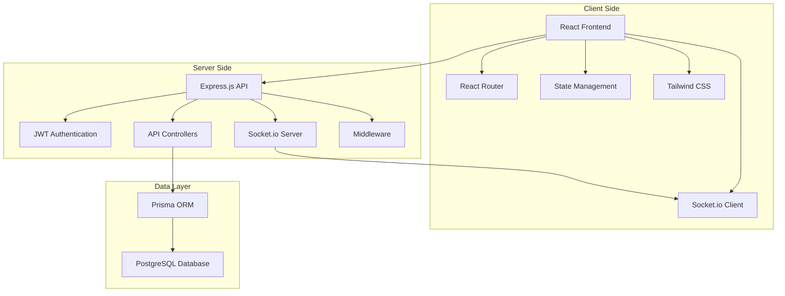
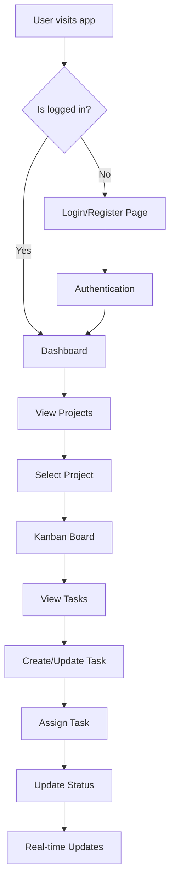
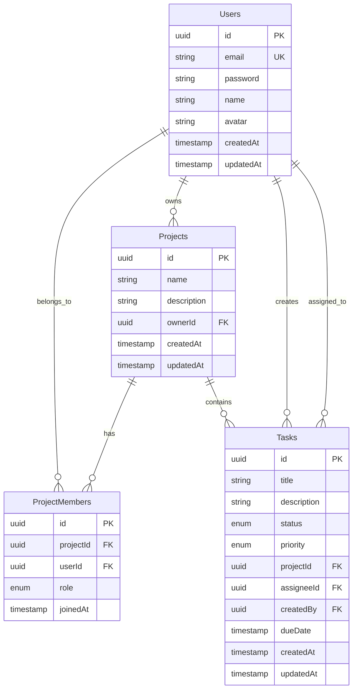
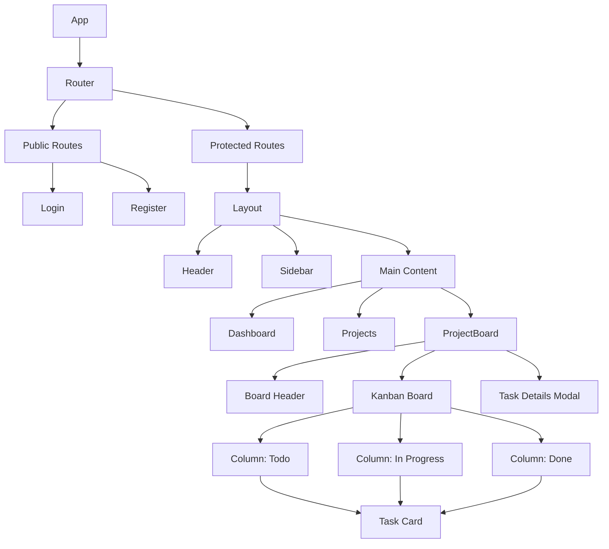
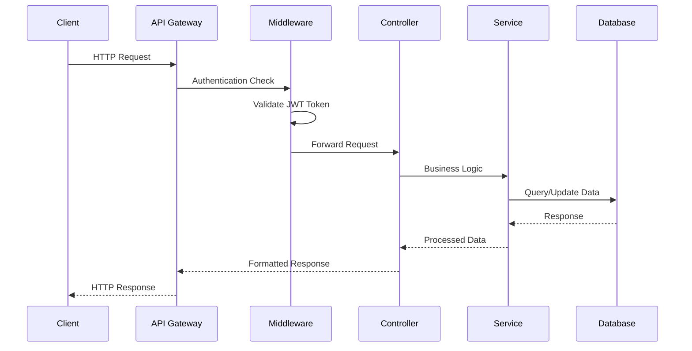
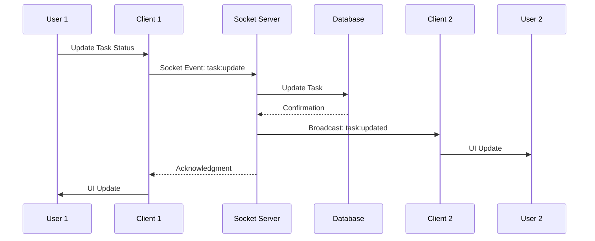
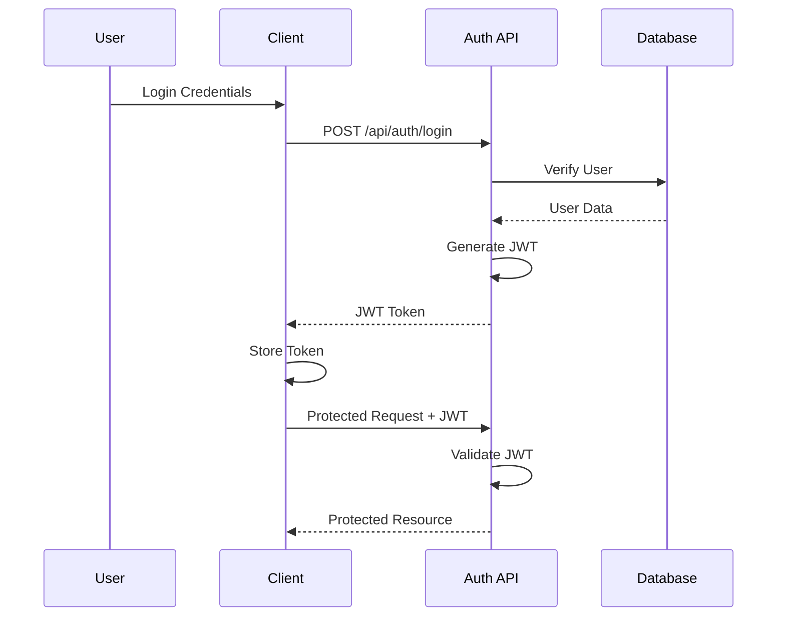

# Personal Task Management Assistant - System Diagrams

## System Architecture Overview



## User Flow Diagram



## Database Relationship Diagram



## Component Architecture



## API Request Flow



## Real-time Update Flow



## Authentication Flow



## Project Structure

```mermaid
graph LR
    subgraph "Root Directory"
        A[client/] --> B[React Frontend]
        C[server/] --> D[Node.js Backend]
        E[docs/] --> F[Documentation]
        G[.gitignore]
        H[README.md]
    end
    
    subgraph "Client Structure"
        B --> I[src/]
        I --> J[components/]
        I --> K[pages/]
        I --> L[hooks/]
        I --> M[context/]
        I --> N[services/]
        I --> O[types/]
    end
    
    subgraph "Server Structure"
        D --> P[src/]
        P --> Q[controllers/]
        P --> R[middleware/]
        P --> S[routes/]
        P --> T[services/]
        D --> U[prisma/]
        D --> V[.env]
    end