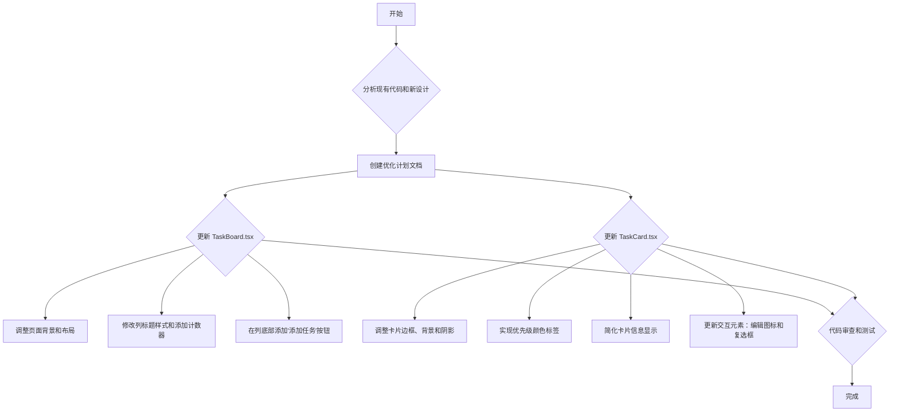

# 看板 UI 优化计划

本文档概述了根据提供的 UI 设计图优化任务看板页面的详细计划。优化将涉及对 `TaskBoard.tsx` 和 `TaskCard.tsx` 组件的修改。

## 1. 整体布局和样式 (`TaskBoard.tsx`)

- **页面背景色**: 将页面主背景色从 `bg-gray-50` 更改为更柔和的灰色或白色，以匹配设计图中的 `F7F8FA`。
- **看板列（Column）**:
    - **列标题**: 更新列标题 (`DroppableColumn`) 的样式，使其字体更大、更粗，并添加任务计数器。
    - **列背景**: 移除或更改列的背景色，使其与页面背景融为一体。
    - **添加任务按钮**: 在每列的底部添加一个“+ 添加任务”按钮，用于在该列中快速创建新任务。
- **页面标题**: 优化页面顶部标题区域，使其更简洁，与设计图风格保持一致。

## 2. 任务卡片样式 (`TaskCard.tsx`)

- **卡片基本样式**:
    - **背景和边框**: 将卡片背景设置为白色，并添加细微的边框和阴影效果，以增加层次感。
    - **圆角**: 统一卡片的圆角大小。
- **内容显示**:
    - **任务标题**: 保持标题的清晰和突出。
    - **任务描述**: 使用更浅的字体颜色显示描述，使其与标题区分开。
    - **优先级标签**:
        - 将当前的文本优先级（例如 "HIGH"）替换为带有颜色编码的标签（高、中、低）。
        - `HIGH`: 红色背景
        - `MEDIUM`: 黄色背景
        - `LOW`: 绿色背景
    - **移除多余信息**: 根据设计图，暂时移除卡片上显示的负责人头像、开始日期和截止日期，以简化视图。
- **交互元素**:
    - **编辑按钮**: 将“编辑”文字按钮替换为一个简单的铅笔图标，放置在卡片的右下角。
    - **选择框**: 在卡片的右上角添加一个复选框，用于批量操作。当前实现中，批量模式下的复选框位于左上角，需要调整位置和样式。
    - **移除状态下拉菜单**: 移除卡片上的状态切换下拉菜单，状态的变更将通过拖拽完成。

## 3. Mermaid 流程图

## 4. 实施步骤

1.  **环境准备**: 确认前端开发环境正常运行。
2.  **组件修改**:
    - 首先修改 `TaskCard.tsx` 以匹配新的卡片设计。
    - 接着修改 `TaskBoard.tsx` 和 `DroppableColumn.tsx` 来更新看板的整体布局和功能。
3.  **样式调整**: 使用 Tailwind CSS 更新样式。
4.  **测试**: 在浏览器中验证所有更改，确保功能和视觉效果符合预期。
